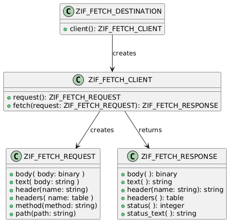

# Fetch ABAP polyfill

ABAP [Fetch API](https://developer.mozilla.org/en-US/docs/Web/API/Fetch_API)-like implementation

## Why do we need polyfill?
We used use `cl_http_client` during long time in our leagcy code. However currently this class is not released for usage in ABAP Cloud. At the same time classes which we use in the cloud such as `cl_http_destination_provider` or `cl_web_http_client_manager` are not available in legacy systems ( Let's say ECC ).

So in few words we face a problem that same code should be written differently in different systems. So this project delivers the idea to have just one truly minimalistic facade which can plug-in different release-specific implementations.

## How to use

Let's make it possible to call something like this which will work in any system
```abap
" we fetch in the same way doesn't matter which release is
" this will work both in the cloud and in the legacy ( with installed plugin )
data(response) = zcl_fetch=>by_url( 'https://petstore.swagger.io/v2/' )->fetch( 'swagger.json' ).
" alternative calls
" URL can be provided fully
data(response2) = zcl_fetch=>by_url( 'https://petstore.swagger.io/v2/swagger.json' )->fetch( ).
" not obligatory to use slash in the end of URL to build a right path
data(response3) = zcl_fetch=>by_url( 'https://petstore.swagger.io/v2' )->fetch( 'swagger.json' ).
" however is important to use relative path in the fetch method. Absolute path will overwrite original path
" this will fetch /swagger.json but not /v2/swagger.json
data(response4) = zcl_fetch=>by_url( 'https://petstore.swagger.io/v2/' )->fetch( '/swagger.json' ).

" supported features:

" access resposnse status
check response->status( ) eq 200.
" access body as binary
data(body_as_binary) = response->body( ).
" or as a text
data(body_as_text) = response->text( ).
" get header value
data(content_type) = response->header( 'Content-Type' ).
" or all headers
data(all_headers) = response->headers( ).
```

## Advanced programming

### Understanding the model
In general here are core components of the model:


### Using the model
```abap
data(destination) = zcl_fetch_destination=>url( target_url )
" or
data(destination2) = zcl_fetch_destination=>rfc( http_rfc_destination_name )
" or 
data(destination3) = zcl_fetch_destination=>cloud( cloud_destination_name )

" create a client
data(client) = destination->client( ).

" create a request
data(request) = client->request( ).

" change the request like
request->method( 'POST' ).
request->body( binary_payload ).
request->header( name = 'Content-Type' value = 'application/json'  ).

" fetch the request and get response
data(response) = client->fetch( request ).

" analyze response
case response->status( ).
    when 200.
        data(response_body) = response->body( ).
    when 500.
        data(error_text) = response->text( ).
endcase.

```

## Plugins
- [Cloud fetch](https://github.com/abapify/fetch-cloud)
- [Legacy fetch](https://github.com/abapify/fetch-legacy)


## Other Dependencies
- [assert](https://github.com/abapify/assert) - unit test assertions
- [throw](https://github.com/abapify/throw) - throw an object as exception

## Alternative solutions
- https://github.com/open-abap/cross-http-client by [@larshp](https://github.com/larshp). WIP

